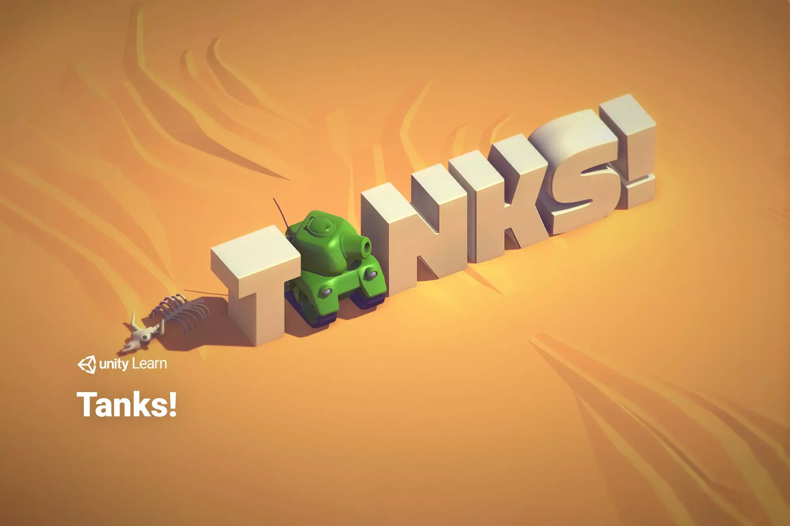
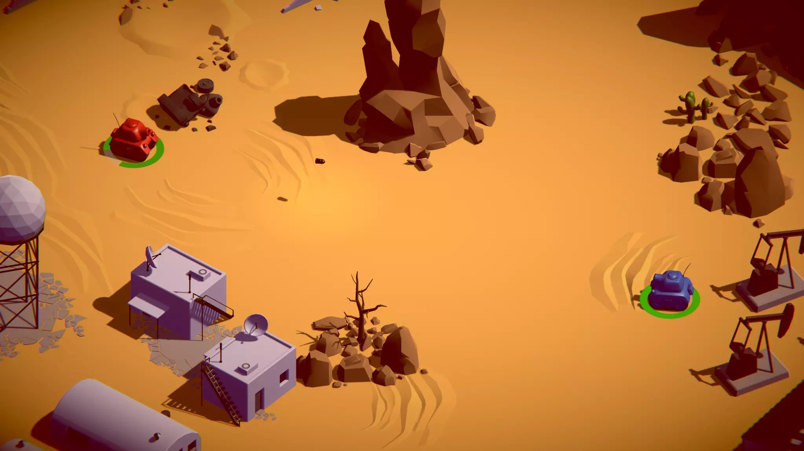
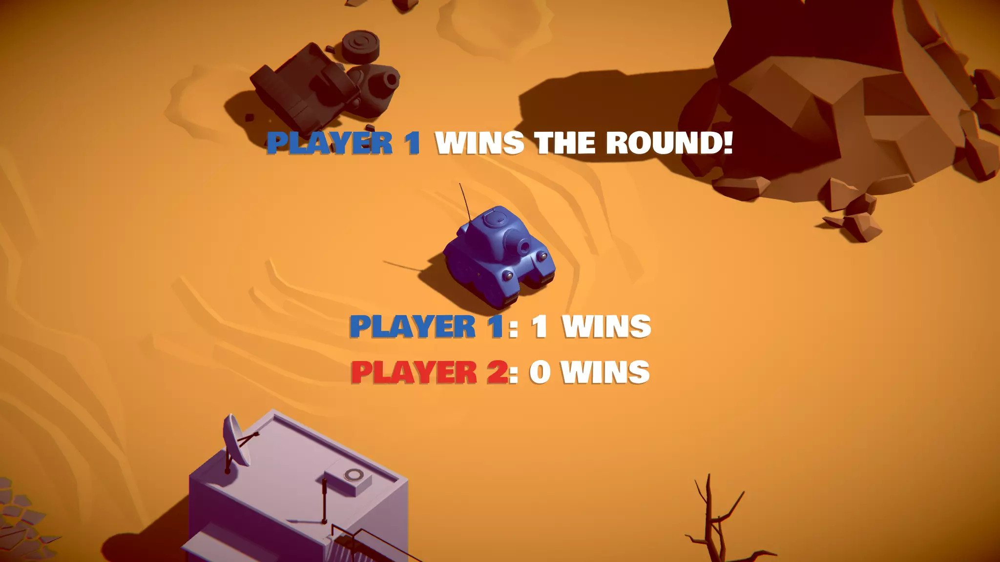

# Tanks Arena 3D

A two-player 3D tank shooter played on a single keyboard, written in C#.

## Overview

Two players control tanks in the same arena and try to outlast each other. The project covers game mechanics, game architecture, world-space and screen-space UI, and audio mixing.

## Features

- Two-player local gameplay on one keyboard
- Shooting and health mechanics
- World-space and screen-space UI
- Structured game architecture (game manager, tank movement, shooting, health, camera control)
- Audio mixing for game sounds
- Round and winner announcements

## Screenshots

  
   
  
   
  

## Tech Stack

- C#
- 3D game development

## Project Structure

- `Assets/Scripts` - gameplay code (managers, tank, shell, camera, UI)
- `Assets/Scenes` - game scene
- `Assets/Prefabs`, `Assets/Models`, `Assets/Materials`, `Assets/AudioClips` - game content
- `Images` - screenshots used in this README

## Acknowledgements

Inspired by the Tanks tutorial project from Unity Learn.
# 3D Tanks Game

A two-player 3D tank shooter played on a single keyboard, written in C#.

## Overview

Two players control tanks in the same arena and try to outlast each other. The project focuses on simple game mechanics, a clean game architecture, world-space and screen-space UI, and audio mixing.

## Features

- Two-player local gameplay on one keyboard
- Shooting and health mechanics
- World-space and screen-space UI
- Structured game architecture (game manager, tank movement, shooting, health)
- Audio mixing for game sounds
- Round and winner announcements

## Screenshots

  
   
  
   
  

## Tech Stack

- C#
- 3D game development

## Acknowledgements

Based on the Tanks tutorial project from Unity Learn.
